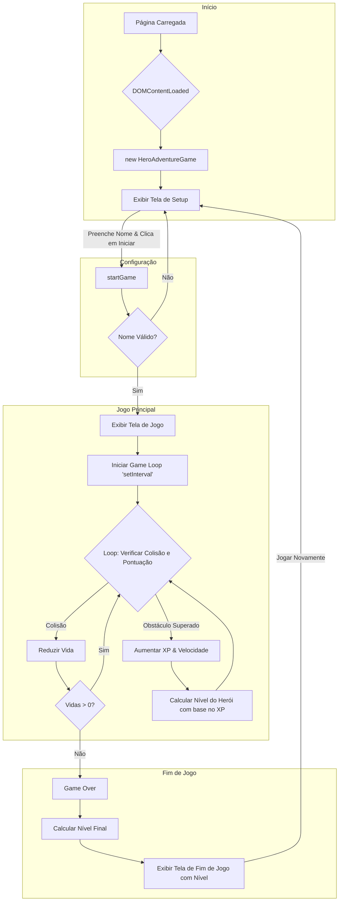

# Aventura do Herói - Documentação Técnica Completa

## 🎯 Visão Geral do Projeto

**Aventura do Herói** é um jogo de corrida infinita 2D com temática cyberpunk, desenvolvido com tecnologias web puras (HTML, CSS e JavaScript), sem a necessidade de frameworks externos. O jogador controla um herói que corre e salta para desviar de obstáculos, acumulando XP para subir de nível.

O projeto foi extensivamente otimizado para **dispositivos móveis**, com um layout responsivo que se adapta à orientação da tela e uma lógica de colisão precisa para garantir uma jogabilidade justa.

## 🎮 Como Jogar

1.  **Abra o jogo:** Abra o arquivo `index.html` em um navegador moderno (desktop ou mobile).
2.  **Dispositivos Móveis:** Gire o dispositivo para a **posição horizontal (paisagem)**. O jogo foi projetado para esta orientação.
3.  **Crie seu Herói:** Na tela inicial, digite o nome do seu herói e clique em "Iniciar Aventura".
4.  **Jogue:**
    *   **Desktop:** Pressione a tecla `ESPAÇO` para saltar.
    *   **Mobile:** Toque em qualquer lugar da tela para saltar.

Cada obstáculo superado concede **100 XP**. O jogo acelera progressivamente, e o jogador tem **3 vidas**.

## 📂 Estrutura de Arquivos

O projeto utiliza uma estrutura clara para separar as responsabilidades:

```
/
├─── assets/
│   └─── img/           # Contém todos os recursos visuais (GIFs, PNGs).
├─── app.js             # Contém toda a lógica do jogo (JavaScript).
├─── index.html         # A estrutura da página e do jogo (HTML).
├─── style.css          # Estilização, animações e layout responsivo (CSS).
└─── README.md          # Esta documentação.
```

## 🛠️ Arquitetura e Detalhes da Implementação

### `index.html`: A Estrutura

O HTML define a estrutura semântica do jogo, organizada em três "telas" principais que são gerenciadas pelo JavaScript:

-   `<div id="setup-container">`: Tela inicial para configuração do herói.
-   `<div id="game-container">`: Tela principal onde o jogo acontece.
-   `<div id="game-over-container">`: Tela de fim de jogo.

A otimização mais importante aqui é o link para o CSS com **cache busting**:
`<link rel="stylesheet" href="style.css?v=2.0">`
O parâmetro `?v=2.0` força os navegadores a baixarem a versão mais recente do CSS, evitando problemas de cache.

### `style.css`: Estilização e Layout Responsivo

O CSS é o coração visual do projeto, responsável pela aparência cyberpunk, animações e, crucialmente, pelo layout responsivo.

-   **Design Tokens (`:root`)**: Variáveis CSS são usadas para centralizar valores de design (cores, tamanhos de fonte, etc.), facilitando a manutenção.
-   **Layout de Tela Cheia (`position: fixed`)**: A arquitetura de layout foi refatorada para usar `position: fixed` nos contêineres de tela (`#game-container`, `.screen`). Isso os ancora diretamente na janela de visualização do navegador, garantindo que ocupem 100% do espaço disponível de forma confiável em todos os dispositivos e resolvendo problemas de corte de conteúdo.
-   **Box Sizing Universal**: A regra `*, *::before, *::after { box-sizing: border-box; }` é aplicada globalmente. Isso garante que o `padding` e a `border` dos elementos sejam incluídos em sua largura e altura totais, prevenindo problemas de layout inesperados.
-   **Animações (`@keyframes`)**: Animações de pulo, movimento de obstáculo e dano são definidas com `@keyframes` e acionadas pela adição/remoção de classes via JavaScript.
-   **Otimização Mobile Agressiva**: Uma `media query` (`@media screen and (max-width: 768px)`) aplica um conjunto de regras que **compactam drasticamente** a UI para telas pequenas, ajustando fontes, espaçamentos e o layout da tela de configuração para um formato de duas colunas no modo paisagem.

### `app.js`: Lógica do Jogo (JavaScript Orientado a Objetos)

Toda a lógica do jogo é encapsulada na classe `HeroAdventureGame`, seguindo os princípios da programação orientada a objetos para organizar o código e gerenciar o estado.

-   **`constructor()`**: Inicializa o jogo, armazena referências aos elementos do DOM (`_cacheElements`) e configura os `event listeners` iniciais.
-   **`gameState`**: Um objeto que centraliza todas as variáveis de estado do jogo (vidas, XP, nome do herói, etc.), tornando o código mais previsível.
-   **Game Loop (`setInterval`)**: O coração do jogo. A função `_checkCollisionAndScore` é chamada a cada 16ms, criando a ilusão de movimento contínuo e verificando o estado do jogo.
-   **Hitbox Virtual (`_checkCollisionAndScore`)**: A lógica de colisão foi refinada para ser mais justa. Em vez de usar as dimensões totais do GIF do obstáculo, ela calcula uma "hitbox virtual" baseada em porcentagens (50% da largura, 90% da altura), ignorando as áreas transparentes e prevenindo colisões acidentais.
-   **Otimizações Mobile (`_setupMobileOptimizations`)**: O código lida com eventos de toque (`touchstart`, `touchmove`) de forma inteligente, prevenindo o comportamento padrão (como rolagem) **apenas** dentro do contêiner do jogo, para não interferir na funcionalidade de formulários em outras telas.

## 🏆 Níveis de Herói e Ranking

A progressão do jogador é marcada por um sistema de níveis (ranks) que são alcançados ao atingir determinadas quantidades de XP. A lógica para determinar o nível está na função `getHeroLevel()` e os dados de cada nível são armazenados em `HeroAdventureGame.CONSTANTS.LEVELS`.

A tabela de níveis é a seguinte:

| Nível      | XP Mínimo |
| :--------- | :-------- |
| Ferro      | 0         |
| Bronze     | 1.001     |
| Prata      | 2.001     |
| Ouro       | 5.001     |
| Platina    | 7.001     |
| Ascendente | 8.001     |
| Imortal    | 9.001     |
| Radiante   | 10.001+   |

## 🌊 Fluxograma Geral do Jogo (Mermaid)

Este fluxograma visualiza o fluxo completo do jogo, incluindo a mecânica de cálculo de nível.

